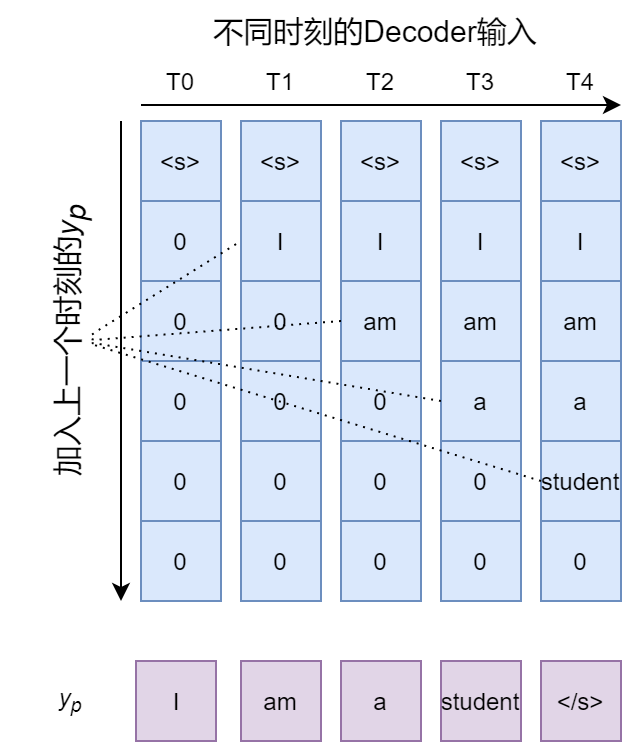
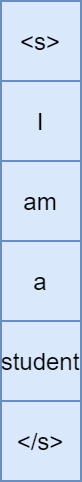

## Transformer

在结构上仍然采用Encoder-Decoder的结构，但是弃去了RNN结构以及其变体。仅采用attention机制，来做编码和解码。解决了时序的依赖，使得模型的训练可以并行。

 结构：

[^1]: 

### Encoder端编码：

通过embedding以及位置编码将每个单词映射成一个定长向量，再输入Encoder模块。

位置编码：

[^1]: 

*pos*是单词xi在src中的位置， *i* 是在d_model中的维度。

输入：src [batch_size, src_len]

输出：src_embed [batch_size, src_len, d_model]

### Encoder结构：

Encoder由多个Encoder layer组成，每个Encoder layer包括三个部分: Multi-Head Self-Attention，Add&Norm，Feed Forward。

[^2]: 

#### Multi-Head Self-Attention:

如果将一组视为一个头，Multi-Head就是重复多组Self-Attention，每次的参数随机初始化，在训练之后，将输入映射到多个子空间。最终将每个head的输出拼接为**Z**，并且通过对**Z**进行加权，得到最后的输出。

[^2]: 

对于Encoder来说**K,V,Q**来自于编码后的输入/前一个Encoder的输出（**R**）。

输入：src_embed/**R** [batch_size, src_len, d_model]

输出：**Z** [batch_size, src_len, d_model]

#### Add&Norm:

加入变换前的信息。并且进行layer norm。

#### FFN：

通过全连接层以及激活函数对每个都做同样的变换。不会引入不同之间的交互。

输入：**Z** [batch_size, src_len, d_model]

输出：**Z** [batch_size, src_len, d_model]

#### Encoder输出：**memory** [batch_size, src_len, d_model]

### Decoder端编码：

通过embedding以及位置编码将每个单词映射成一个定长向量，再输入Decoder模块。shifted right的意义是给tgt语句的起始增加一个特殊的起始符号<s>，所以相当于原始的tgt序列整体右移一位。比如原始语句为“I am a student”右移后变为“<s> I am a student”。

输入：tgt [batch_size, tgt_len] (shifted right)

输出：tgt_embed [batch_size, tgt_len, d_model]

### Decoder结构：

Decoder由多个Decoder layer组成，每个Decoder layer包括四个部分: Self-Attention with Mask，Encoder-Decoder Attention，Add&Norm，Feed Forward。

[^2]: 

#### Self-Attention with Mask: 

对于Self-Attention的输入是ground truth 序列，为了防止信息泄露，对于一个长度为T的tgt序列，位置为i的词只能与前i个词计算权重（即i+1~T之后的词对应权重为0）。所以需要对输入做Mask操作，在Softmax操作前对权重矩阵（seq_len * seq_len）根据Mask矩阵对矩阵值填充-inf，Softmax后被遮盖部分的权重即为0：

[^5]: 

这样就能保证加权过程中，**每个时间的词只能与之前产生的词产生联系**。tgt_embed作为**K,V,Q**的来源。

输入：tgt_embed [batch_size, tgt_len, d_model]

输出：dec_self_attn [batch_size, tgt_len, d_model]

#### Encoder-Decoder Attention:

对于Decoder中的Encoder-Decoder attention, **K, V**来自于最后一个Encoder层的输出（memory），**Q**来自于Decoder的Multi-Head Attention的输出。

输入：dec_self_attn [batch_size, tgt_len, d_model]，memory [batch_size, src_len, d_model]

输出：dec_enc_attn [batch_size, tgt_len, d_model]

#### Add&Norm和FFN：

计算方式与Encoder相同。

#### Decoder输出: dec_output [batch_size, tgt_len, d_model]

### Linear&Softmax:

得到了Decoder输出的向量，通过简单的全连接神经网络，它将解码器产生的向量投影到一个更大的向量中，称为logits向量。logits 向量的每个单元格对应一个唯一单词的分数。Softmax 层将这些分数转换为概率，选择概率最高的单元格，并生成与之关联的单词作为该时间步的输出。

[^2]: 

输入：dec_output [batch_size, tgt_len, d_model]

输出：dec_logits [batch_size, tgt_len, tgt_vocab_size]

### Transformer中的Mask:

#### Mask的作用：

1. 处理非定长序列，区分padding和非padding部分，使得模型屏蔽padding的信息。
2. 防止标签泄露。

#### Encoder中的Mask：

由于翻译问题的输入和输出是不定长的序列，对于过长的序列需要截断，对于长度不够的序列需要padding到定长。但是 padding 对应的字符只是为了统一长度，并没有实际的价值，通过Mask就能屏蔽掉padding的部分。在pytorch的transformer模块中为src_key_padding_mask [batch_size, src_len]。Encoder也能通过src_mask [src_len, src_len]在进行 Self-Attention时屏蔽部分位置。

#### Decoder中的Mask：

Decoder的Self-Attention需要tgt_mask [tgt_len, tgt_len]，为一个上三角矩阵，上三角值为float('-inf')，为被遮盖的地方，下三角值为0.0，是参与attention运算的地方。tgt_key_padding_mask [batch_size, tgt_len]为tgt遮盖padding的内容。Encoder-Decoder Attention中可以通过memory_key_padding_mask [batcg_size, src_len]和memory_mask [tgt_len, src_len]进行mask操作。

### 训练策略:

有两种训练策略：

1. Free Running，以batch_size为1举例，按照时间顺序把模型的预测序列输入Decoder，得到模型得到输出[1, tgt_len, tgt_vocab_size]。将概率转化为对应的词后，输出为[1, tgt_len]的向量，选择对应i时刻的词作为本次的 。</s>为句子结束的符号。缺点是如果中间某个时刻模型的输出严重偏离ground truth，会影响后续时刻的翻译。

   

2. Teacher Forcing，一次把ground truth都输入Decoder。得到预测[1, tgt_len, tgt_vocab_size]，将概率转化为对应的词后，[1, tgt_len]的向量就是这个句子的翻译。缺点是依赖标签数据，在训练过程中，模型会有较好的效果，但是在测试的时候没有ground truth，模型的泛化能力可能有限。

   

Transformer的训练策略采用Teacher Forcing，预测时由于没有ground truth可以参考，只能采取时间顺序的预测。

### 参考：

[1]: https://dl.acm.org/doi/10.5555/3295222.3295349	"Attention is all you need"
[2]: http://jalammar.github.io/illustrated-transformer/	"The Illustrated Transformer"
[3]: https://pytorch.org/docs/stable/generated/torch.nn.Transformer.html?highlight=transformer#torch.nn.Transformer	"TRANSFORMER"
[4]: https://blog.csdn.net/qq_30219017/article/details/89090690	"一文弄懂关于循环神经网络(RNN)的Teacher Forcing训练机制"
[5]: https://zhuanlan.zhihu.com/p/139595546	"NLP 中的Mask全解 - 海晨威的文章 - 知乎"

